<div align="center">

# 小暖 · XiaoNuan

### 不慌不忙，温暖如初 · 静谧伴读，从容管家

**一个可以全家人一起用的本地 AI 助手，沉淀全家知识与时光手账。**  
由希扬（[@lepfinder](https://github.com/lepfinder)）精心打造的 **本地优先（Local-First）** 私有家庭智能中枢。

[](https://xiaonuan.me/)
[](https://github.com/lepfinder/xiaonuan-releases/releases/latest)
[](https://xiaonuan.me/)

<br>

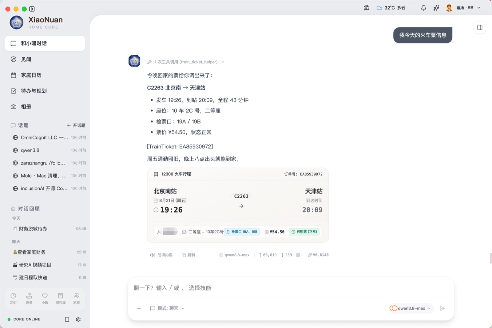

<br><br>

🌐 **官方网站**：[https://xiaonuan.me/](https://xiaonuan.me/) · 👨‍💻 **关于作者**：[希扬的工作室](https://xiyang.ai.studio/)

</div>

---

## 📖 关于小暖 (XiaoNuan)

小暖不是又一个冷冰冰的网页聊天窗口，而是运行在您本地电脑上的**私有家庭智能管家与伴学管家**。

她可以帮你做深入研究、读长文、理清逻辑，也会记得你家每一个成员的生日、成长里程碑与全家重要的纪念日。
全家对话、相册照片、日历待办、见闻手账、家庭纪念日与账本数据 **100% 保存在您本地的硬盘中**。核心隐私数据绝不上传云端，数据主权完全属于家庭。

> **“一家人的日子，都收在这一处。”**

---

## 📦 桌面端下载安装

当前稳定版本：**v0.1.46**（开箱即用，支持多架构与增量更新）

| 操作系统 / 芯片架构 | 安装包类型 | 下载通道 |
| :--- | :--- | :--- |
| **macOS (Apple Silicon)** | M1 / M2 / M3 / M4 芯片 (`.dmg`) | [📥 下载 arm64 安装包](https://github.com/lepfinder/xiaonuan-releases/releases/latest/download/XiaoNuan-0.1.46-arm64.dmg) |
| **macOS (Intel)** | Intel 芯片 (`.dmg`) | [📥 下载 x64 安装包](https://github.com/lepfinder/xiaonuan-releases/releases/latest/download/XiaoNuan-0.1.46.dmg) |
| **Windows** | Windows 10 / 11 64位 (`.exe`) | [📥 下载 Windows 安装程序](https://github.com/lepfinder/xiaonuan-releases/releases/latest/download/XiaoNuan.Setup.0.1.46.exe) |

> 💡 **macOS 首次启动提示「文件已损坏」或安全拦截？**  
> 打开 Mac 的 **终端 (Terminal)**，复制并执行以下命令即可正常打开：  
> ```bash
> xattr -cr /Applications/XiaoNuan.app
> ```

---

## ✨ 真实界面与核心特性

下面是正在日常使用的真实小暖界面，而非概念渲染图。

### 1. 智能对话与伴读伴学 · 像家人一样说话，也能把事情做完

丢一篇文章给小暖，她会读完、归纳、给出判断，并支持一键剪藏进库；输入 `/` 即可随时调用快捷技能，话题式会话互不干扰。

<p align="center">
  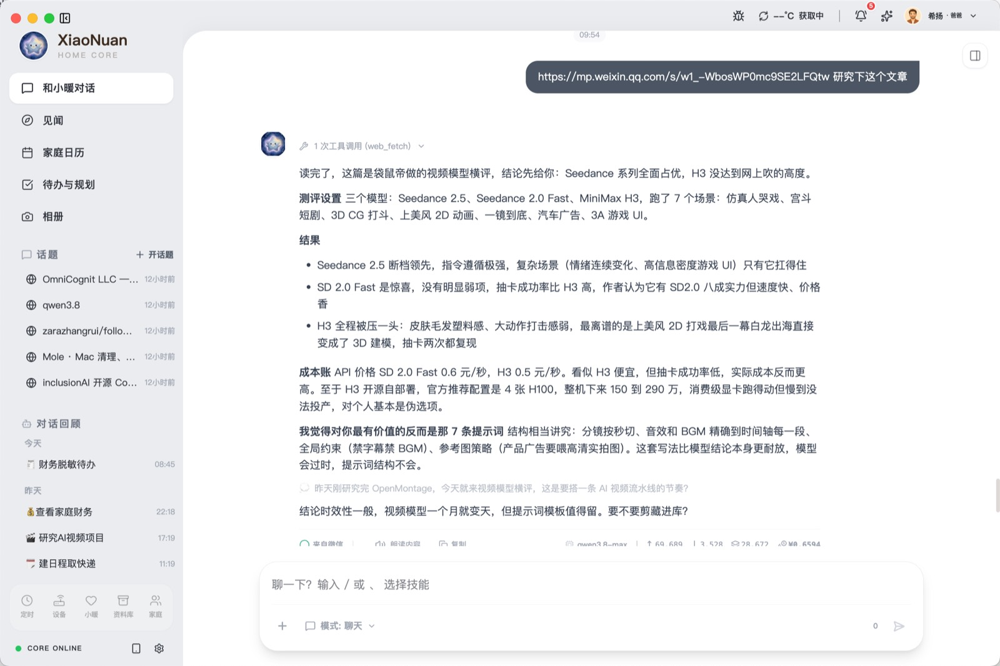
</p>

- 🧠 **大模型中立**：一键接入华为 MaaS、DeepSeek、阿里云百炼、火山引擎、Moonshot Kimi、智谱 GLM 或本地 Ollama。
- 📚 **研究型伴读**：长文深度拆解，概念溯源，研读结论自动沉淀。

---

### 2. 见闻手账 · 朝闻天下、暮省一日、展卷有得

早上扫一眼，家里今天要发生什么；晚上暮省一日，把全天的所得与收获妥善收藏。

<p align="center">
  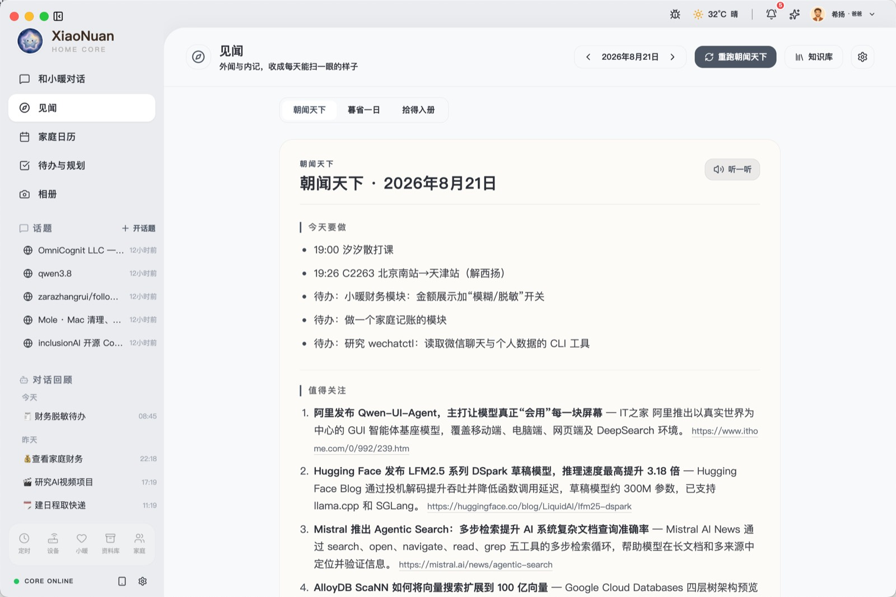
</p>

- 🌅 **朝闻与暮省**：当日日程、待办重点与家庭动态聚合呈现，不是嘈杂的信息流，而是专门为这一家剪裁的日刊。
- 📖 **展卷有得**：每天一张定制藏书票插画与经典名句，全年轻量离线打包，随时在桌旁展卷沉浸。

---

### 3. 家庭日历与纪念日 · 一张月历，装下出行、课表与生活琐碎

课程表、高铁火车行程、京东淘宝物流、剪藏记录与传统农历节气叠在一张月历格子里。

<table align="center" width="100%">
  <tr>
    <td width="50%" align="center">
      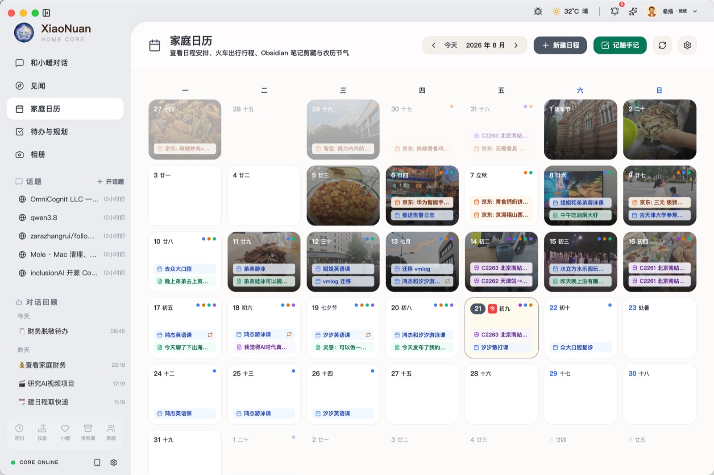<br>
      <sub><b>家庭月历全览</b>：日程、节气、纪念日一览</sub>
    </td>
    <td width="50%" align="center">
      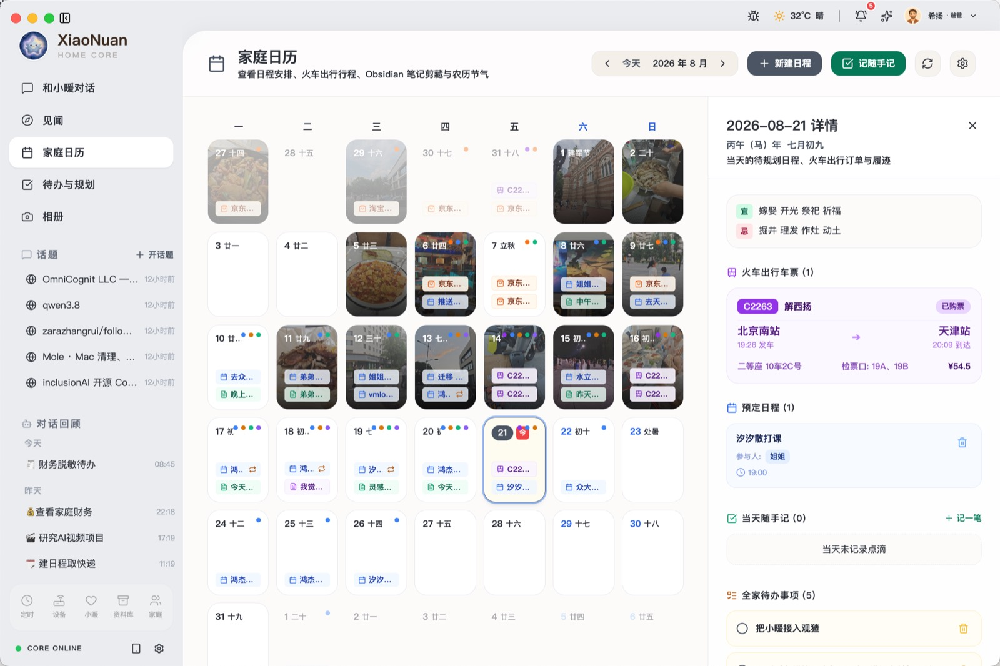<br>
      <sub><b>当日详情</b>：车次车票、课表与待办并排呈现</sub>
    </td>
  </tr>
</table>

---

### 4. 待办与规划 · 这一周，全家人的事从容摊在桌上

按周展开的家庭任务看板，工作与家事分栏推进，紧急与常规一眼可辨。

<p align="center">
  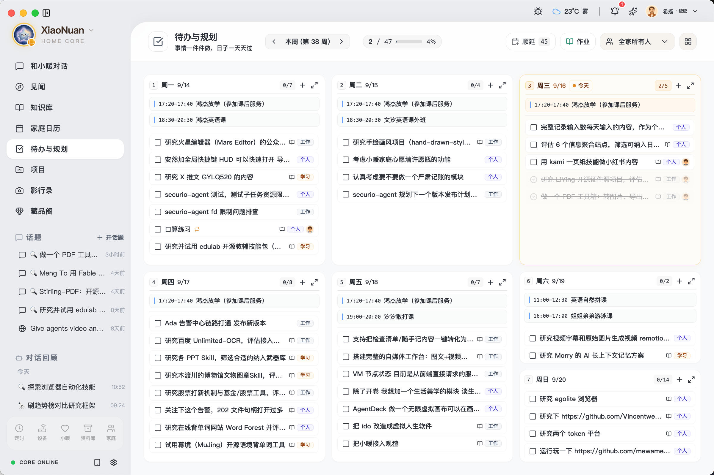
</p>

- 📋 **双轨分栏**：个人深度工作与家庭公共琐事各自独立，协同清晰。
- 🎯 **周进度透视**：完成度在页眉实时反映，不用反复追问「这周还剩什么」。

---

### 5. 私有时光相册 · 照片留在家里，不送进别人的云

按时光轴静静浏览本地照片，原图完整保留在自己的硬盘上，点击即可查看拍摄时间、地点与地图轨迹。

<table align="center" width="100%">
  <tr>
    <td width="50%" align="center">
      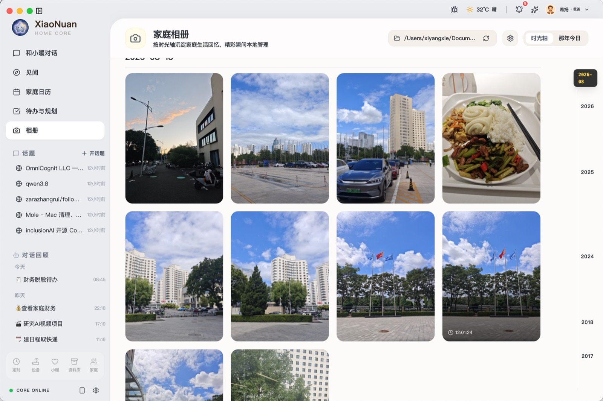<br>
      <sub><b>时光相册</b>：按年、月时光轴沉淀成长回忆</sub>
    </td>
    <td width="50%" align="center">
      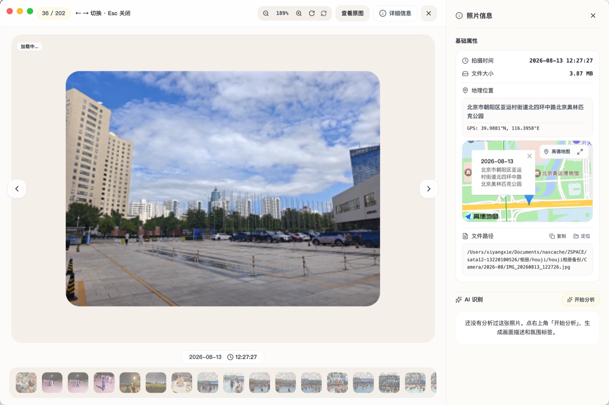<br>
      <sub><b>照片细节</b>：拍摄参数、地点地图与关联记忆</sub>
    </td>
  </tr>
</table>

---

### 6. 知识库与家庭生活微矩阵

结论进 Wiki，原料进剪藏；账本脱敏记，出行不手忙。

<table align="center" width="100%">
  <tr>
    <td width="50%" align="center">
      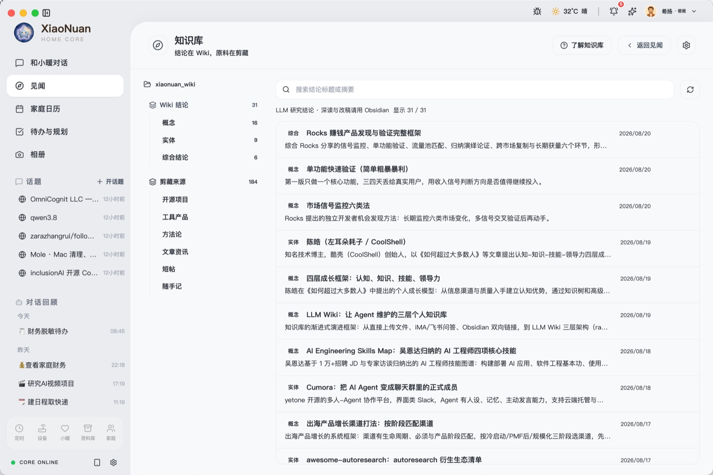<br>
      <sub><b>知识库</b>：结论沉淀为可检索的 Wiki，深度笔记连通 Obsidian</sub>
    </td>
    <td width="50%" align="center">
      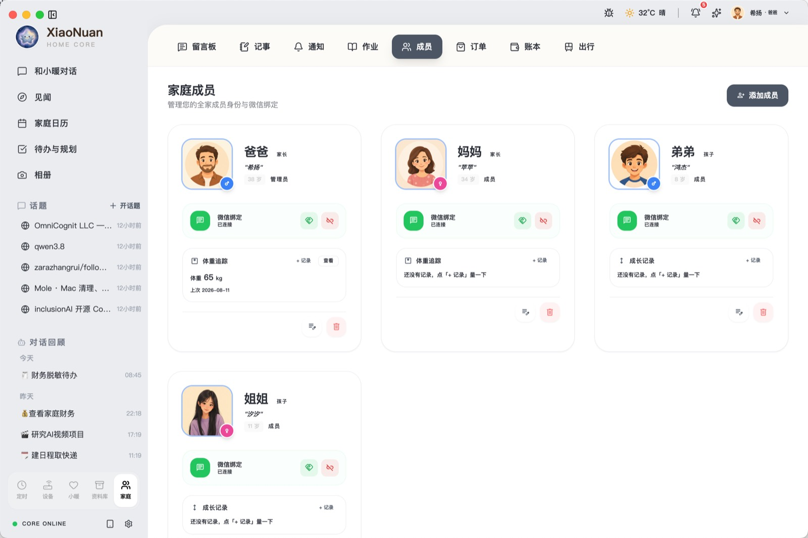<br>
      <sub><b>家庭成员</b>：身份角色、成长点滴与微信协同</sub>
    </td>
  </tr>
  <tr>
    <td width="50%" align="center">
      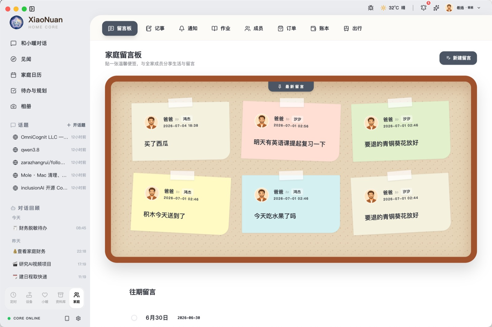<br>
      <sub><b>家庭留言板</b>：给家人随手贴一张温情便签</sub>
    </td>
    <td width="50%" align="center">
      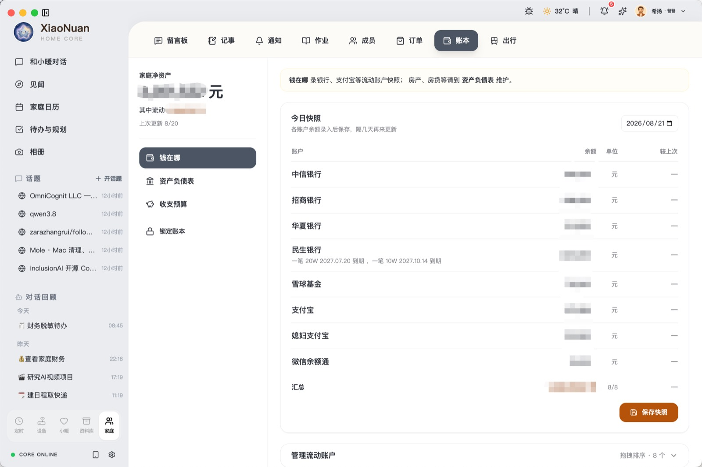<br>
      <sub><b>家庭账本</b>：本地私密记账与收支趋势分析</sub>
    </td>
  </tr>
</table>

---

## 🛡️ 本地优先 (Local-First) 架构理念

小暖从第一行代码开始，便严格践行 **Local-First** 准则：

1. **数据自主权**：所有家庭成员信息、对话记忆、生活记录、日历待办、账本数据均保存在本机的 SQLite 和本地文件中，不经由第三方服务器中转。
2. **离线高可用**：无网环境下，本地日历、照片、待办、历史知识库依然 100% 可用、即点即开。
3. **模型可自由替换**：你可以随时在设置中切换云端厂商 API 或本地私有部署的模型（如 Ollama），不与单一平台捆绑。

---

## 🔗 相关链接与社区

- 🌐 **官方主页 (Official Site)**: [https://xiaonuan.me/](https://xiaonuan.me/)
- 📦 **发布与镜像仓 (Releases Repo)**: [lepfinder/xiaonuan-releases](https://github.com/lepfinder/xiaonuan-releases)
- 👨‍💻 **作者个人主页**: [https://xiyang.ai.studio/](https://xiyang.ai.studio/)
- 📮 **作者 GitHub**: [@lepfinder (希扬)](https://github.com/lepfinder)

---

<div align="center">
  <sub>不慌不忙，温暖如初。© 2026 HomeCore Team & 希扬 (lepfinder). Crafted with love for family.</sub>
</div>
